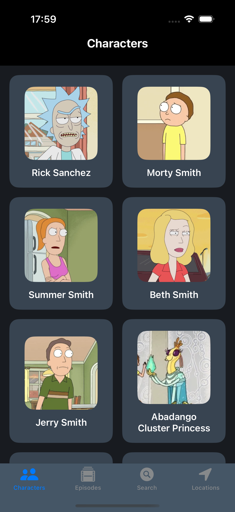
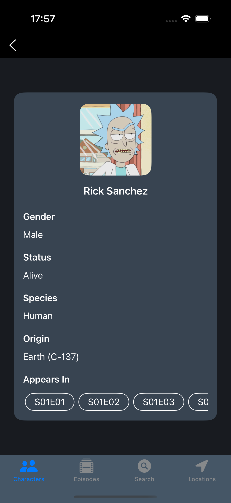
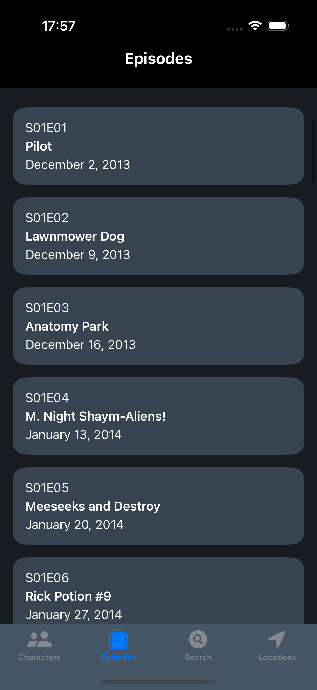
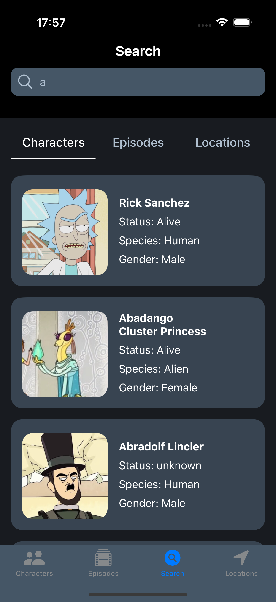
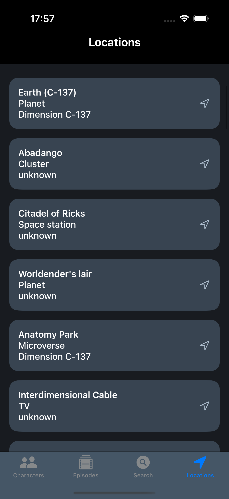

# 🛸 RickAndMorty

A SwiftUI-based iOS app that lets users browse and search characters, episodes, and locations from the Rick and Morty API. Implements custom UI components, MVVM architecture, and asynchronous data fetching with error handling.

## 🚀 Features

- **Browse Easily:** Dedicated tabs for Characters, Episodes, and Locations.
- **Search Functionality:** Search and filter items in real time.
- **Pagination:** Pagination support in all main lists to load data efficiently.
- **Dynamic Navigation:** A custom Coordinator Pattern managing NavigationStack for seamless transitions between views.

## 📱 Screenshots

         
 
## 🛠 Tech Stack

- **Language:** Swift  
- **UI Framework:** SwiftUI
- **Architecture:** MVVM-C
- **Concurrency:** Swift Async/Await
- **Networking:** URLSession
- **Backend:** [Rick and Morty API](https://rickandmortyapi.com/).

## ⚙️ Requirements & Setup

- **iOS:** 18.5 or later  
- **Xcode:** 16.4 or later  

## Installation / Setup

1. Clone the repository:  
   ```bash
   git clone https://github.com/nnttl/RickAndMorty.git
2. Open the project in Xcode
3. Run the app (⌘R)
